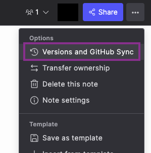
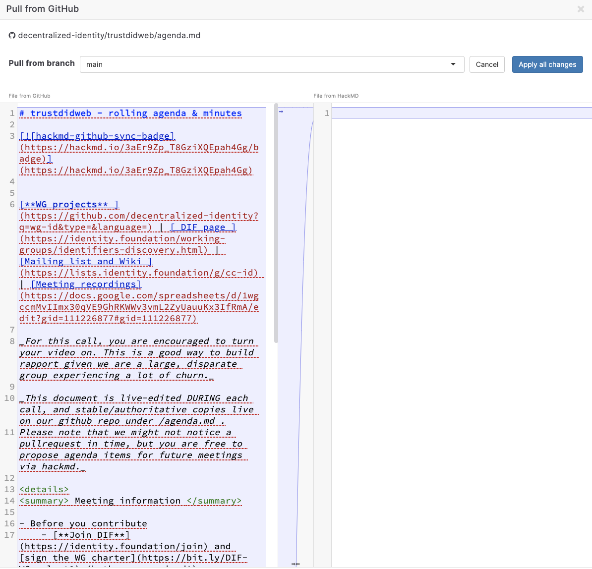

# DIF Agenda File Guidelines

## Purpose of agenda.md

DIF working group and work item repositories include an `agenda.md` file by convention. Its purposes are:

1. **Pre-meeting**: Chairs outline the meeting agenda.
2. **During/Post-meeting**: Chairs (or delegates) record important takeaways, including:
   - Key decisions
   - Action items or followups
   - Substantive discussion outcomes

**Note**: Keep `agenda.md` notes brief, as meetings are recorded with transcripts. Focus on major points only.

**Tip**: Use GitHub "issues" for detailed work and progress tracking. Reference these issues in meeting notes rather than duplicating information.

## Structure and Content

See [Credential Schemas agenda.md](https://github.com/decentralized-identity/credential-schemas/blob/main/AGENDA.md) for an example.

A typical agenda includes:

- Time to review GitHub issues and pull requests
- List of discussion points
- Space for group members to add agenda items

Best practices:

- Consider adding time estimates (in minutes) for each agenda item
- Include major topics discussed and range of viewpoints on key issues
- Include relevant links, including those shared in Zoom chat

## Managing the agenda.md File

1. **Regular use**: Keep a running agenda with the most recent meeting at the top.
2. **Rotation**: When the file becomes too large (HackMD may disallow live editing):
   - Create a new file named "agenda-YYYY-Q.md" (e.g., "agenda-2024-2.md" for Q2 2024)
   - Move current agenda.md contents to this new file
   - Clear agenda.md, retaining only structure and upcoming meeting details

This rotation maintains manageable file size and preserves meeting history.

## HackMD Integration

You may use the HackMD / Github integration for collaborative editing. See [HackMD GitHub sync tutorial](https://hackmd.io/c/tutorials/%2F%40docs%2Fsync-a-note-with-github) for official instructions.

### HackMD Setup Tips

The official instructions are unclear in places, so below are some screenshots demonstrating setup.

1. You can create a new note or import from within an existing note

Creating a new note: "New note" > "Import a file from Github"


- Within an existing note: "..." > "Versions and Github Sync"



2. Select the repo and branch, then pull the content


3. Select "Apply all changes"



4. Close that window and you will see the agenda.md file in hackmd


**Tip**: HackMD supports its own notion of teams, separately from GitHub teams. To allow others in your group to access, set up a HackMD team with working group members allowed to edit. You may need to explicitly transfer ownership of the note to the team

**Note**: Edit collaboratively during the meeting, and make sure you push changes back to GitHub afterward.

## Importance of Meeting Notes

1. **Keeping members informed**: Allows those who miss calls to stay updated and determine which recordings to watch.
2. **Context for GitHub activity**: Provides background for code changes and discussions.
3. **Community engagement**: Helps the wider community follow progress of discussions and work items.
4. **DIF communication**: Forms the basis for the DIF newsletter.
5. **Historical record**: Maintains a history of conversations, important for IPR reasons.

**Tip**: If your working group needs to keep detailed minutes (not standard practice), use collapsible HTML sections:

```html
<details>
  <summary>TITLE</summary>
  CONTENT
</details>
```

By maintaining clear, concise, and well-structured agenda files, we ensure effective communication and progress tracking across DIF working groups and work items.
